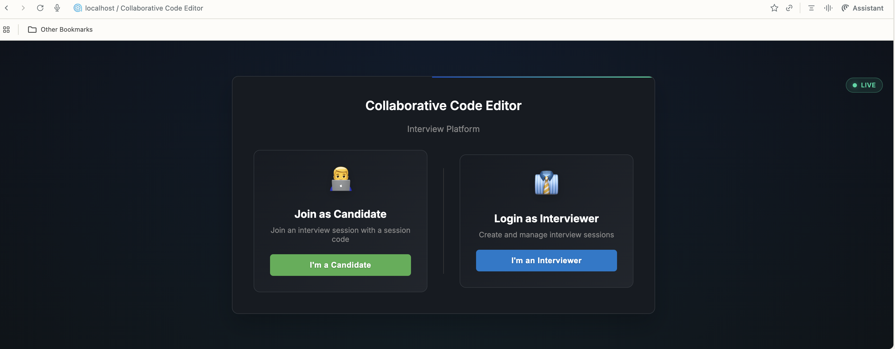
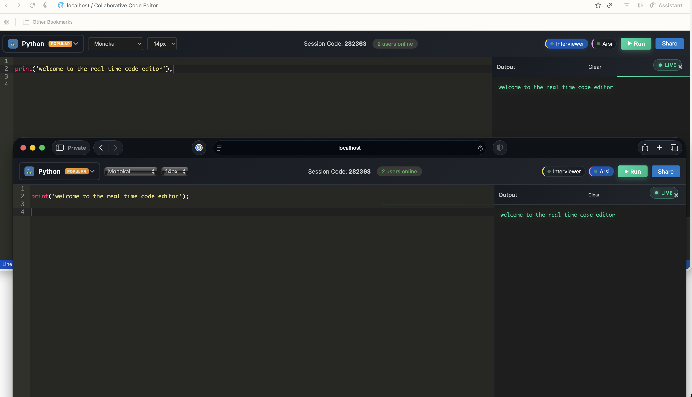
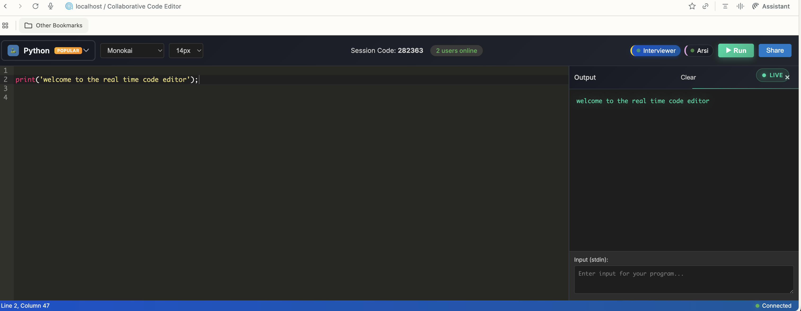
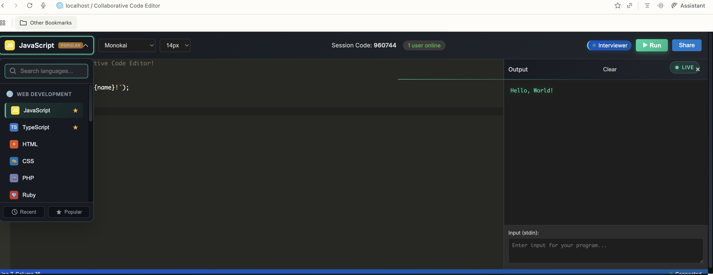
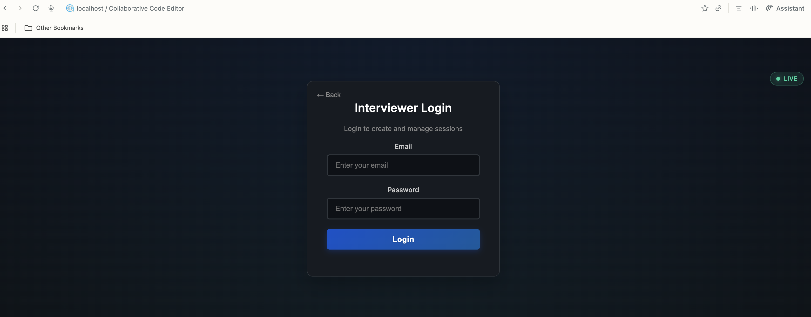

# 🚀 OpenCode - Free Real-time Collaborative Coding Interview Platform


**Build your own CodePad/HackerRank alternative for $0/month!**

OpenCode is a free, open-source real-time collaborative coding platform perfect for conducting technical interviews. Built with Firebase,Firepad, Piston and ACE Editor, it provides a easy to interview setup with zero downpayment!

## 📸 Screenshots

<div align="center">
  
### Login Screen


### Real-time Collaboration


### Code Editor with Multiple Languages


### Language Selector


### Interviewer Dashboard


</div>

## 🎯 Why OpenCode?

| Feature | CoderPad | HackerRank | OpenCode |
|---------|----------|------------|----------|
| Monthly Cost | $599+ | $819+ | **$0** |
| Real-time Collaboration | ✅ | ✅ | ✅ |
| Code Execution | ✅ | ✅ | ✅ |
| Multiple Languages | ✅ | ✅ | ✅ |
| Custom Branding | ❌ | ❌ | ✅ |
| Self-Hosted | ❌ | ❌ | ✅ |
| Open Source | ❌ | ❌ | ✅ |

## ✨ Features

- 🔄 **Real-time collaborative editing** - See changes instantly
- 🌍 **16+ programming languages** - JavaScript, Python, Java, C++, and more
- ▶️ **Live code execution** - Run code directly in the browser
- 👥 **Role-based access** - Separate interviewer and candidate permissions
- 🔢 **Simple 6-digit codes** - Easy session sharing (like Zoom!)
- 👀 **Live presence indicators** - See who's online
- 🎨 **Multiple themes** - Dark mode included
- 📱 **Zero setup for candidates** - Just share the code and start

## 🛠️ Tech Stack

- **Firebase** (Free tier) - Real-time database & hosting
- **Firepad** - Operational transformation for collaboration
- **ACE Editor** - Industry-standard code editor
- **Piston API** - Free code execution service

## 🚀 Getting Started

### Setup Instructions (2 minutes)

#### 1. Clone the repository
```bash
git clone https://github.com/humancto/opencode.git
cd opencode
```

#### 2. Set up Firebase
1. Go to [Firebase Console](https://console.firebase.google.com) → Create Project
2. Click ⚙️ Settings → Scroll to "Your apps" → Click `</>` Web icon
3. Copy the config values

#### 3. Configure the app
```bash
# Copy the example config file
cp lib/firebase-sdk.example.js lib/firebase-sdk.js

# Edit lib/firebase-sdk.js and add your Firebase credentials
```

#### 4. Enable Realtime Database
In Firebase Console → Realtime Database → Create Database → Start in test mode

#### 5. Run the app
```bash
python3 -m http.server 8000
```

**Done!** Access at http://localhost:8000

## 📖 Usage Guide

### For Interviewers

1. Click "I'm an Interviewer"
2. Login with default credentials:
   - Email: `admin@opencode.com`
   - Password: `admin123`
3. Click "Create New Session"
4. Share the 6-digit code with candidates

### For Candidates

1. Click "I'm a Candidate"
2. Enter your name
3. Enter the 6-digit session code from interviewer
4. Click "Join Session"

## 🔧 Customization

### Change Admin Credentials
Edit `scripts/auth.js`:
```javascript
const ADMIN_CREDENTIALS = {
  email: 'your-email@company.com',
  password: 'your-secure-password'
};
```

### Change Branding
Edit `index.html`:
```html
<title>YourCompany - Coding Interviews</title>
<h2>YourCompany Code Editor</h2>
```

### Adding more languages

Edit `scripts/firepad.js` and add to `languageConfig`:
```javascript
const languageConfig = {
  // ... existing languages
  scala: { mode: 'ace/mode/scala', ext: 'scala' },
  // Add more as needed
};
```

### Customizing themes

The platform supports all ACE editor themes. Add more options in the theme selector dropdown in `index.html`.

## 🔐 Security

### Production Database Rules

For production, update your Firebase Realtime Database rules:

```json
{
  "rules": {
    "sessions": {
      "$sessionId": {
        ".read": true,
        ".write": true,
        ".validate": "newData.hasChildren(['firepad'])"
      }
    }
  }
}
```

### Best Practices

1. **Use environment variables** for sensitive data in production
2. **Implement proper authentication** - Consider Firebase Auth for production
3. **Add rate limiting** to prevent abuse
4. **Monitor usage** to stay within Firebase free tier limits

## 📊 Firebase Free Tier Limits

- **Realtime Database**: 1GB storage, 10GB/month transfer
- **Hosting**: 10GB storage, 360MB/day transfer
- **Simultaneous connections**: 100

This is sufficient for:
- ~100 concurrent interviews
- ~1000 interviews per month
- ~10,000 code executions

## 🐛 Troubleshooting

### "Permission Denied" Error
- Check your Firebase Realtime Database rules
- Ensure rules are set to allow read/write

### Real-time sync not working
- Check browser console for errors
- Verify Firebase credentials are correct
- Ensure you're using HTTPS in production

### Candidates can't type
- Clear browser cache
- Check for JavaScript errors
- Ensure only one tab per session is open

## 🤝 Contributing

Contributions are welcome! Please feel free to submit a Pull Request.

1. Fork the repository
2. Create your feature branch (`git checkout -b feature/AmazingFeature`)
3. Commit your changes (`git commit -m 'Add some AmazingFeature'`)
4. Push to the branch (`git push origin feature/AmazingFeature`)
5. Open a Pull Request

## 📈 Roadmap

- [ ] Video/audio calling integration
- [ ] Question bank system
- [ ] Automated testing/evaluation
- [ ] Multiple files support
- [ ] Whiteboard feature
- [ ] Recording & playback
- [ ] Analytics dashboard

## 💰 Monetization Ideas

While OpenCode is free, you could:
1. Offer hosted version as SaaS ($49/month)
2. Provide enterprise support & customization
3. Build premium features (AI evaluation, etc.)
4. White-label solution for companies

## 📜 License

MIT License - feel free to use this for commercial projects!

## 🙏 Acknowledgments

- [Firebase](https://firebase.google.com) - Real-time database & hosting
- [ACE Editor](https://ace.c9.io) - Code editor
- [Piston](https://github.com/engineer-man/piston) - Code execution engine

## ⭐ Star History

If this project helped you save money or land a great hire, please star it!

## 📧 Support

- Create an issue for bugs
- Start a discussion for features
- Follow me [@humancto](https://Linkedin.com/in/archithr)

---

**Built with ❤️ to democratize technical interviews**

*Saved your company $599/month? Consider [buying me a coffee](https://buymeacoffee.com/humancto) ☕*
